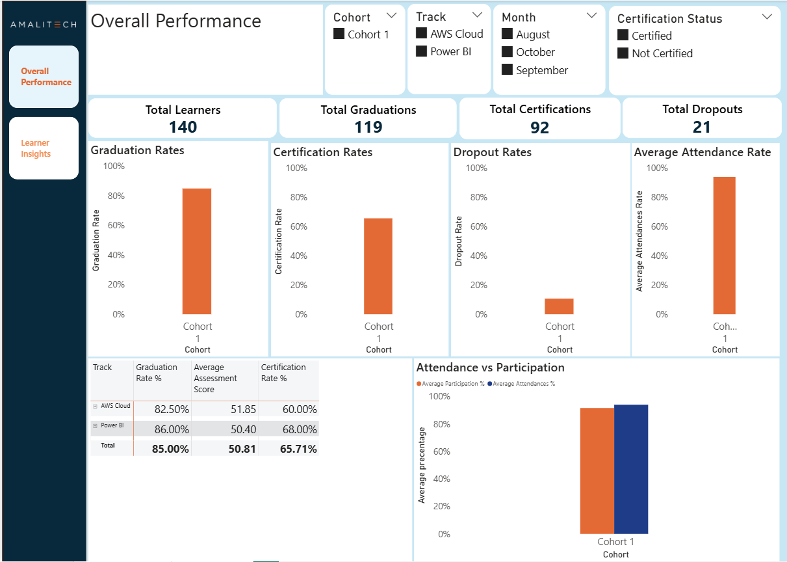
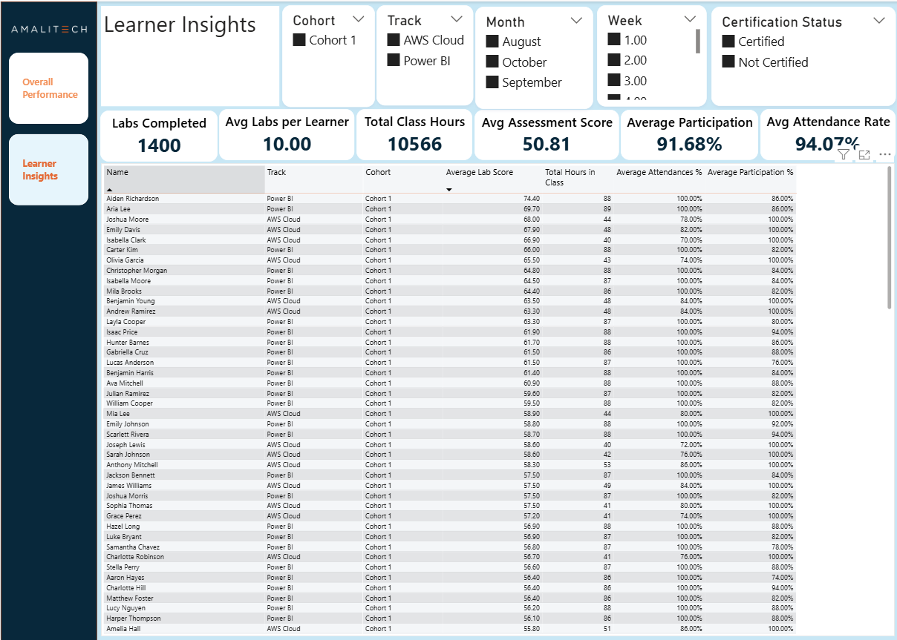

# Dare Careers – Student Progress & Performance Dashboard

---

# Project Overview

This Power BI dashboard was developed for **Dare Careers**, a training organization offering programs in **Power BI** and **AWS Cloud**.

The solution provides a comprehensive view of learner engagement, academic performance, attendance compliance, and certification outcomes over a 10-week training program.

It enables program managers and trainers to:

* Monitor learner progress
* Identify dropouts and at-risk learners
* Evaluate certification and graduation performance
* Track attendance and participation trends

---

# Project Structure

```
Dare-Careers-Dashboard/
│
├── Dare_Careers_Dashboard.pbix
├── README.md
│
└── images/
    ├── page1_overall_performance.png
    ├── page2_learner_insights.png
    └── data_model.png
```

---

# Dashboard Screenshots

## 🔹 Page 1 – Overall Performance



This page provides a high-level summary of program performance.

### Key Metrics:

* Total Learners: 140
* Total Graduations: 119
* Total Certifications: 92
* Total Dropouts: 21

### Performance Rates:

* Graduation Rate: 85%
* Certification Rate: 65.71%
* Dropout Rate: 15%
* Average Attendance Rate: ~94%

### Visuals Included:

* Graduation Rate (Bar Chart)
* Certification Rate (Bar Chart)
* Dropout Rate (Bar Chart)
* Average Attendance Rate (Bar Chart)
* Attendance vs Participation (Clustered Column Chart)
* Track Performance Summary (Matrix)

### Filters:

* Cohort
* Track (Power BI / AWS Cloud)
* Month
* Certification Status

---

## 🔹 Page 2 – Learner Insights



This page provides detailed learner-level analysis.

### KPI Cards:

* Total Labs Completed: 1400
* Average Labs per Learner: 10
* Total Class Hours: 10,566
* Average Assessment Score: 50.81
* Average Participation Rate: 91.68%
* Average Attendance Rate: 94.07%

### Detailed Table Includes:

* Learner Name
* Track
* Cohort
* Average Lab Score
* Total Hours in Class
* Attendance %
* Participation %

### Filters:

* Cohort
* Track
* Month
* Week
* Certification Status

---

# Data Preparation

Data was imported from structured CSV folders:

* Zoom Attendance
* Participation Records
* Labs
* Quizzes
* Learner Status

## Attendance Rule Applied

A learner is marked as **Attended = 1** if:

```
Zoom Session Duration > 30 minutes
```

This rule was applied consistently across all attendance calculations.

Weekly lab and quiz records were aggregated to compute average assessment scores.

---

# Data Model Design

The dashboard follows a **Star Schema Model**.

### Dimension Tables:

* Learners
* Date Table

### Fact Tables:

* Zoom Attendance
* Participation Records
* Labs
* Quizzes
* Status of Participant

Relationships were defined using:

```
Learners[email] → Fact Tables[email]
Date[Date] → Attendance & Participation[Date]
```

Single-direction filtering ensures accurate aggregation and performance optimization.

---

# Key DAX Calculations

### Total Learners

```DAX
Total Learners = DISTINCTCOUNT(Learners[email])
```


### Total Graduations

```DAX
Total Graduations = 
CALCULATE(
    COUNTROWS('Status of Participant'),
    'Status of Participant'[Graduation Status] = "Graduate"
)
```

### Graduation Rate

```DAX
Graduation Rate % = COALESCE(
DIVIDE(
    [Total Graduations],
    [Total Learners],
    0
), 0)
```

### Total Certifications

```DAX
Total Certifications = 
CALCULATE(
    COUNTROWS('Status of Participant'),
    'Status of Participant'[Certification Status] = "Certified"
)
```

### Certification Rate

```DAX
Certification Rate % = COALESCE(
DIVIDE(
    [Total Certifications],
    [Total Learners],
    0
), 0) 
```
### Non Graduate Rate

```DAX
Non Graduate Rate % = 
DIVIDE(
    [Total Non Graduates],
    [Total Learners],
    0
) 
```

### Dropout Rate

```DAX
Dropout Rate % = COALESCE(
DIVIDE([Non Graduate Rate %], [Total Learners], 0), 0)
```

### Attendance Rate

```DAX
Attendance % = COALESCE(
DIVIDE(
    SUM('Zoom Attendance'[Attended]),
    COUNT('Zoom Attendance'[Date]),
    0
), 0)
```

### Participation Rate

```DAX
Participation % = 
DIVIDE(
    SUM('Participation Records-2'[Participation Score]),
    COUNTROWS('Participation Records-2'),
    0
)
```

---

# Key Insights

* Strong overall graduation rate (85%)
* High average attendance (~94%)
* Strong participation levels (~92%)
* Balanced performance between Power BI and AWS Cloud tracks
* Certification rate lower than graduation rate (area for improvement)

---

# Tools Used

* Power BI Desktop
* Power Query (M Language)
* DAX
* Star Schema Modeling
* Custom JSON Theme

---

# Business Value

This dashboard provides Dare Careers with:

* Real-time monitoring of learner performance
* Early detection of dropout risk
* Data-driven decision-making
* Performance comparison across tracks
* Scalable reporting structure for future cohorts

---

# Conclusion

The Dare Careers Student Progress Dashboard successfully integrates attendance, participation, assessment, and certification data into a unified, interactive reporting solution.

The dashboard supports operational oversight, strategic decision-making, and continuous program improvement.

